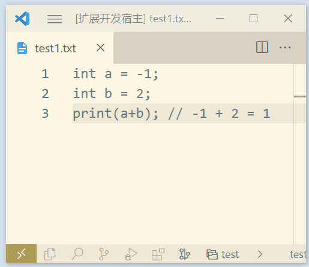

# 如何启动

环境要求：
- node v16.15.1
- vs code 最新版

安装依赖：

```shell
npm i
```

打包并监听文件改动

```shell
npm run watch
```

按 F5 启动

# 如何工作

在新弹出的\[扩展开发宿主\]窗口里，打开任意文件，写符合语法的代码，然后 Ctrl + Shift + P，执行 `Run Mao Language`，有弹窗显示当前打开的文件的执行结果



# Q&A

- 按 F5 启动插件后，插件代码从 `active` 起没有被执行
  - 检查 `package.json` 里 `engines` 的版本，是否高于当前 vs code 版本
